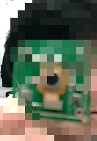
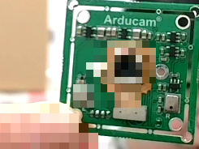
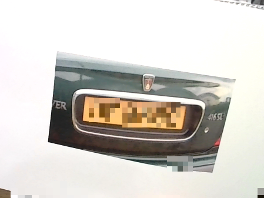

# person_privacy（プライバシー保護？ツール）
This is simple person covered by mosaic
これは人間だけモザイクをかけるシンプルツールです。

# Update

## facenum.py: A Low-Cost Privacy Protection Script

**Overview**

This Python script, `facenum.py`, was developed as an attempt to create a low-cost privacy protection software inspired by a similar solution showcased at CES. It focuses on protecting privacy by mosaicking human faces and alphanumeric characters within images.

**Key Features**

* **Human Segmentation:** Employs a pre-trained segmentation model to ensure 100% coverage of human figures in images.
* **Character and Digit Masking:** Despite the lack of a highly accurate pre-trained model, the script effectively masks characters and digits, providing a significant level of privacy protection.
* **Cost-Effective:** This solution offers a much more affordable alternative to expensive commercial software.

**How to Use**

To run the script, simply execute the following command in your terminal:

```bash
python facenum.py

```
- masked image


- removed mask


- car number plate mask


# jupyter notebook series

- Learn＿PersonMosaic.ipynb
- Little kids can enjoy him/herself magic figure
https://github.com/mi-kaneyon/person_privacy/tree/main/jupyter
## command line

```
python person_privacy.py 

```

## Mosaic level adjustment parameter
- and you can modify resolution, if you want to change resolution
- cam fps depends on resolution, processors.. You can modify as you like.
- 解像度の変更などは下記のパラメータ変更することによって対応できます。ただし、コマ数はマシン環境によります。ご了承ください。
```
# Set the video resolution to 1280x720
cap.set(cv2.CAP_PROP_FRAME_WIDTH, 1280)
cap.set(cv2.CAP_PROP_FRAME_HEIGHT, 720)

mosaic_level = 16  # Adjust mosaic level as desired

```

# Virtual_studio（バーチャルスタジオ、どこでもスタジオ）
- 背景を任意の背景に固定し、人間だけ登場させるツールです。
- If you want hide background, plz check this repository.

https://github.com/mi-kaneyon/Virtual_Studio

Manyan3 --
